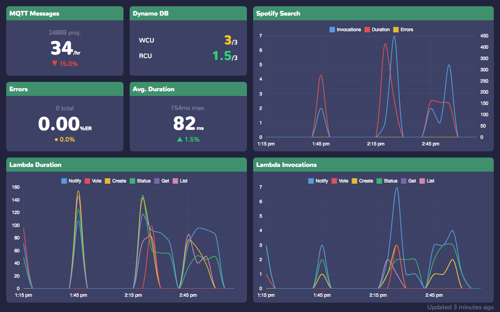

# Vue Cloudwatch Dashboard



This project's asthetic was heavily inspired by [Vuepoint](https://github.com/ashtonmeuser/vuepoint). Much of the charting functionality has been stripped in favor of a simple means of interacting with CloudWatch metrics data. They may be added later. The project also favors a responsive layout that works on mobile devices.

## Commands

First, clone the repo. Run `npm install` to install dependencies. Run one of the following commands to build.

```bash
# build for production
npm run build

# development mode
npm run dev

# run unit tests
npm test

# serve the bundled dist folder in production mode
npm run serve
```

## Credentials

The app expects there to be a `.env.{NODE_ENV}` file in the following format:

```
API_ENDPOINT={YOUR_API_ENDPOINT}
API_KEY={YOUR_API_KEY}
```

Replace `NODE_ENV` with `development`, `test`, or `production`. These will be loaded when built for the respective environments and used to interact with your API. See the next section for setting up an endpoint using AWS Gateway and Lambda.

## Lambda Function

An AWS Lambda function can be used to serve properly formatted metrics to the CloudWatch Dashboard. Please see the [server](server) directory. To deploy, upload the [archive](server/archive.zip) to a Lambda function either via the AWS CLI or the web interface. If you make changes to the server-side logic, make sure you recreate and reupload the archive. 

Create an endpoint using AWS API Gateway properly secure it with an API key or other security measure.

Please note that AWS charges for accessing CloudWatch metrics, so securing your endpoint should be a priority. This should also influence the refresh rate you choose. CloudWatch pricing information can be found [here](https://aws.amazon.com/cloudwatch/pricing/).

## AWS IAM Permissions

The Lambda function must have access to the `cloudwatch:GetMetricData` permission. Create a role in IAM to allow Lambda to access the correct resources.
